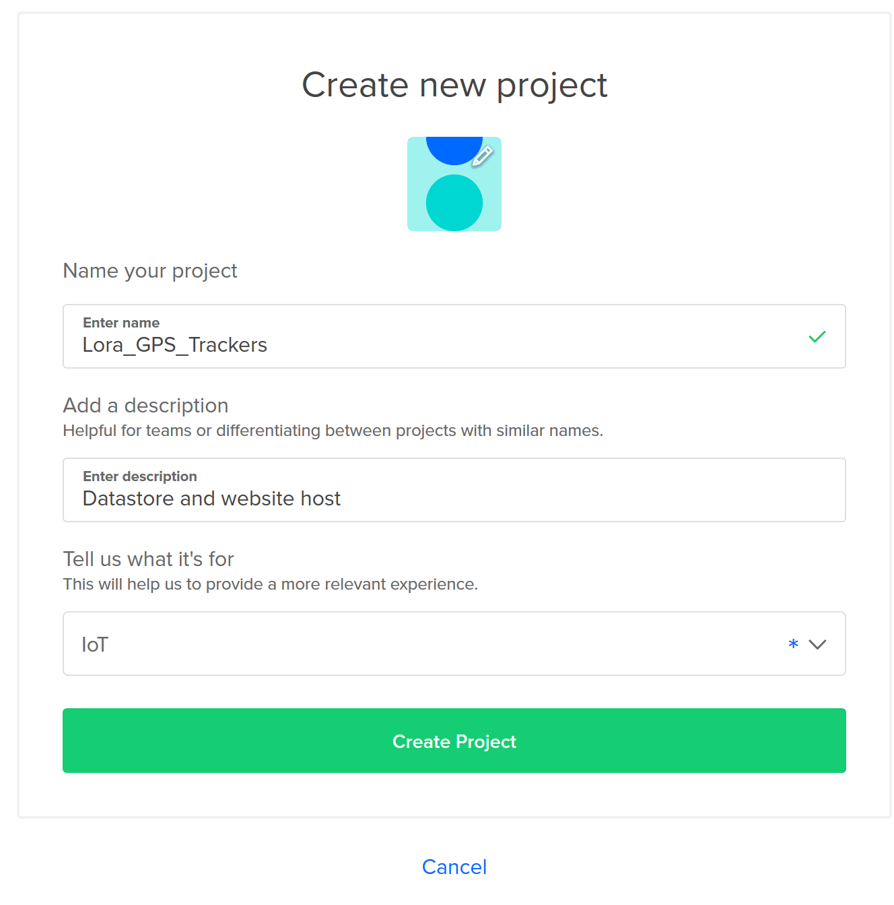

# Remote Server Setup

For this project I used Digital Ocean's to provide a virtual private server to host the InfluxDB database and static site.

0. Create a private/public key.
* I use the Windows Subsystem for Linux so I followed the example [here](https://www.digitalocean.com/community/tutorials/how-to-set-up-ssh-keys--2)
 
1. Create new project, can skip moving resources.


2. Create a Droplet. 
* I went for a standard $5 a month option
* No backups
* No additional options
* Add the public-key generated in Step 0
* Click create

3. Attach Networking Rules
* Create rules to allow TCP traffic on at least 8086 and 3000

4. Login to Droplet.
* Once the droplet has finished setting up you can login on the computer which generated the public/private keypair using:
```
ssh root@xx.xx.xx.xx
```

5. Open firewalls
```
ufw allow 8086/tcp
ufw allow 3000/tcp
```
